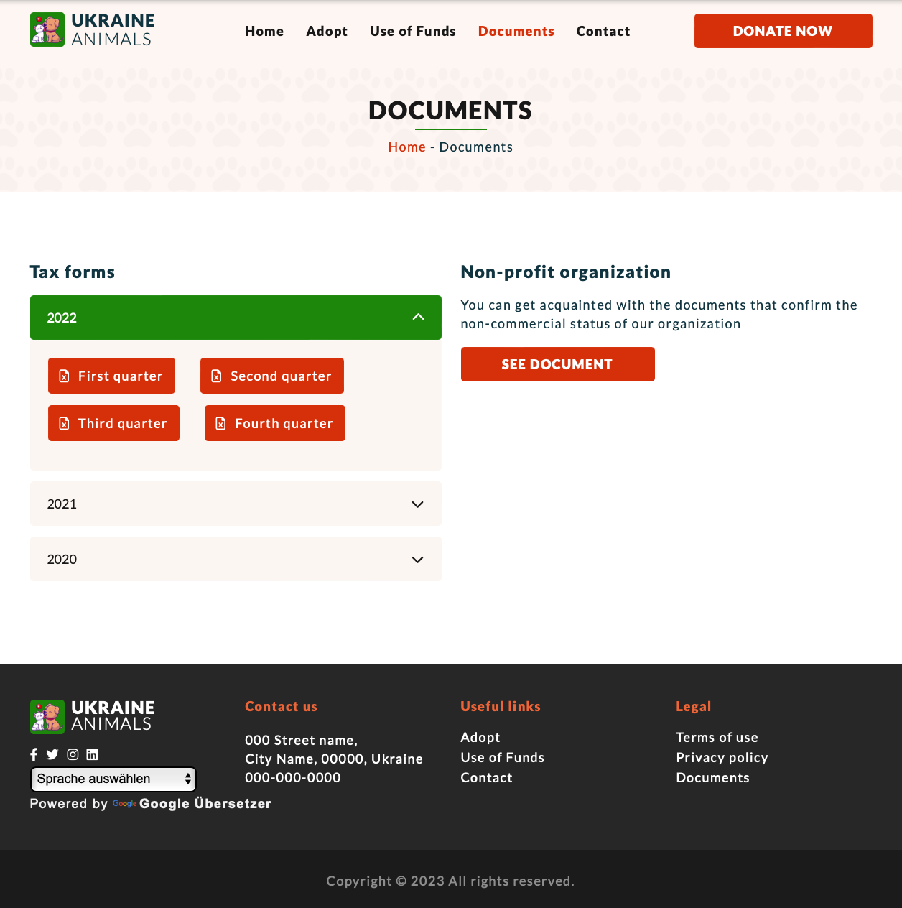

# UKRAINE ANIMALS - PET RESCUE WEBSITE

- Project: Ukraine Animals - Pet Rescue Website
- Student Name: https://github.com/randomoi/

### ABOUT
 A user-friendly website for international donors to assist displaced Ukrainian animals. The user-centered design can efficiently translate the website into over 100 languages, streamline the donation process, provide essential financial disclosure information to build trust, and match international donors with adoptable pets. The website is intended for international donors, adopters, and third-party grant officers.

## TABLE OF CONTENTS
1. [HOW TO IMPORT DATABASE](#DATABASE)
2. [HOW TO RUN WEBSITE](#HOWTORUNWEBSITE)
3. [HOW TO TRANSLATE](#HOWTOTRANSLATE)
4. [HOW TO MAKE A DONATION](#HOWTOMAKEADONATION)
5. [HOW TO ADOPT A PET](#HOWTOADOPTAPET)
6. [HOW TO VIEW TAX FORMS](#HOWTOVIEWTAXFORMS)
7. [HOW TO TROUBLESHOOT](#HOWTOTROUBLESHOOT)
8. [BROWSER](#BROWSER)
9. [LIBRARIES](#LIBRARIES)

### 1. HOW TO IMPORT DATABASE
- Import database into MySQLWorkbech
- Connect Database in Visual Studio Code
- Updated user name and password in utils/database.js

### 2. HOW TO RUN WEBSITE
- Open the source code in Visual Studio Code and run the program the terminal **node index.js**
- Type in browser **http://localhost:8089/**

### 3. HOW TO TRANSLATE
- Select preferred language in the header or footer

### 4. HOW TO MAKE A DONATION
- Click on the **Donate Now** button in the header
- Fill out the payment form
- Click submit

### 5. HOW TO ADOPT A PET
- Click on **Adopt** in the header or **Find Pet** button on the homepage
- Click on the image of the pet you like
- Fill out **Application Form**
- Click submit

### 6. HOW TO VIEW TAX FORMS
- Click on the **Expenses** button on the home page or **Documents** in the header
- Select year
- Click on the Q1 to see the document
- You may download the document by pressing the **Download** button at the bottom of the screen

### 7. HOW TO TROUBLESHOOT
- Run the website in Chrome;
- Right click anywhere on the screen;
- Select **Inspect**;
- Select **Console**;
- Review **Errors** and **Warnings**;

### 8. BROWSER
Tested in:
  * Google Chrome
  * Safari
  * Firefox

### 9. LIBRARIES
* Bootstrap
* Fancy Box
* Font Awesome
* JQuery
* Swiper

### Website Design

